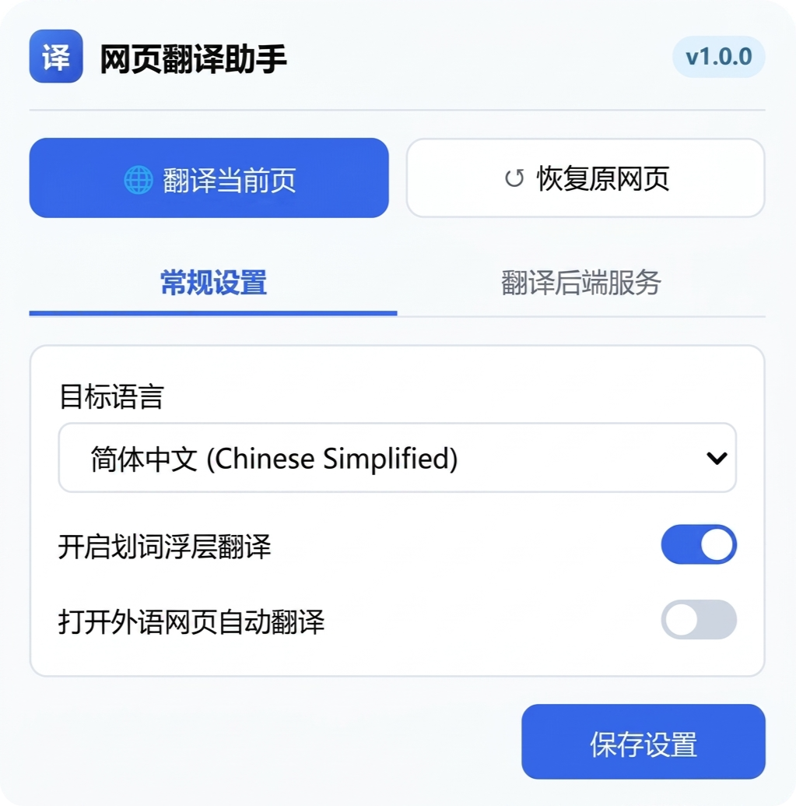
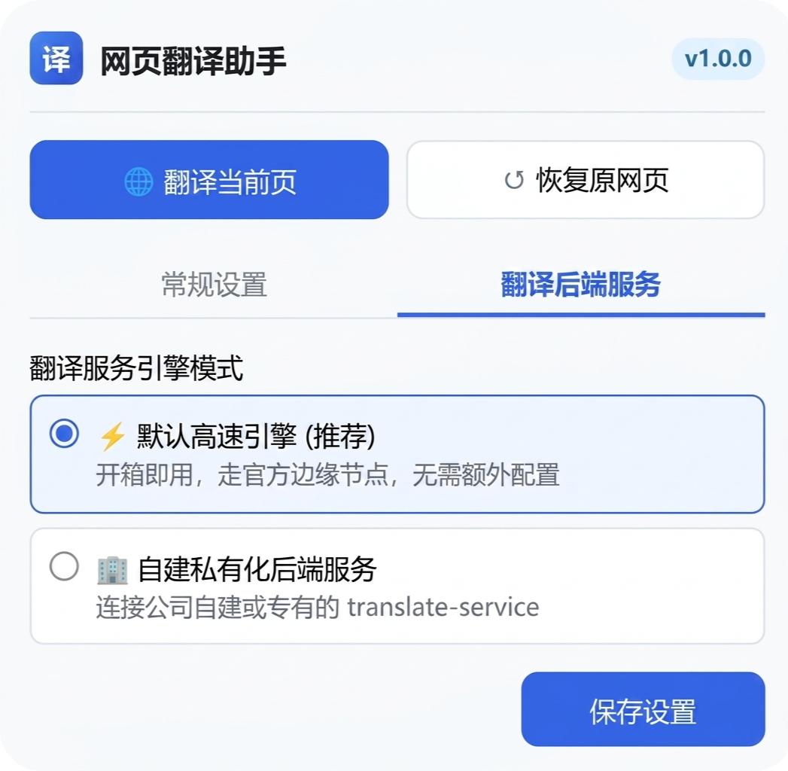

# 🌐 WebTransX

> Web Translate Pro - 智能网页翻译助手

基于 [`translate.js`](https://github.com/xnx3/translate) 打造的现代化 Chrome 扩展程序，支持全网页双语/多语言翻译、划词浮层翻译、智能防冲突检测以及自建私有化后端服务。

---

## 🌟 核心特性

1. **🛡️ 智能防冲突与防重复加载机制**：
   - 自动检测宿主网页是否已经自主引入了 `translate.js`；
   - 若宿主网页已存在实例，插件自动切换为"无缝复用模式"，仅下发语言切换指令，杜绝重复注入、覆盖全局变量、事件死循环与 DOM 冲突；
   - 若未存在，插件将安全沙箱化注入并初始化。

2. **🚀 双模翻译引擎体系（默认高速 + 自建私有后端）**：
   - **默认高速模式 (推荐)**：开箱即用，通过分布式边缘加速通道执行翻译，免配置。
   - **自建私有化后端**：支持填写企业自建或私有化部署的 `translate-service` 服务地址（带地址合法性校验与一键连通性测试）。

3. **✨ 划词浮层翻译**：
   - 页面任意选词选句后，弹出悬浮图标或结果面板，支持一键复制译文和多语言即时翻译。

4. **⚡ 网页整页秒级翻译**：
   - 一键将整页动态翻译为简体中文、繁体中文、英语、日语、韩语、法语、德语、西班牙语等。

---

## 📁 目录结构

```text
WebTransX/
├── manifest.json            # 扩展配置清单 (Manifest V3)
├── content_script.js        # 网页注入脚本 (包含防冲突检测、划词弹窗与整页调度)
├── background.js            # 后台 Service Worker (跨域 API 代理、右键菜单、翻译调度)
├── bridge.js                # 页面主世界桥接脚本 (CSP 穿透与 translate.js 挂载)
├── translate.js             # translate.js 核心库
├── panel.css                # 划词浮层与状态栏样式
├── popup/
│   ├── popup.html           # 扩展弹窗界面 (支持常规设置与后端配置)
│   └── popup.js             # 弹窗交互与存储逻辑
├── docs/
│   └── images/              # 界面截图
│       ├── popup-settings.png   # 常规设置页面
│       └── popup-backend.png    # 翻译后端服务页面
├── icons/                   # 16/48/128 分辨率图标
├── LICENSE                  # MIT 许可证
├── .gitignore               # Git 忽略规则
└── README.md                # 使用与开发说明
```

---

## 🚀 安装与使用教程

### 第一步：在 Chrome 中加载扩展

1. 打开 Chrome 浏览器，在地址栏输入 `chrome://extensions/` 并按回车。
2. 在右上角开启 **开发者模式** (Developer mode)。
3. 点击左上角的 **加载已解压的扩展程序** (Load unpacked)。
4. 选择本项目中的 `WebTransX` 文件夹即可完成加载。

### 第二步：配置翻译引擎 (可选)

1. 点击浏览器右上角扩展栏的翻译图标。
2. 切换到 **"翻译后端服务"** 标签页：
   - 如果保持默认：默认选择 **"默认高速引擎"**，开箱即用。
   - 如果有企业自建服务：选择 **"自建私有化后端服务"**，输入您的后端地址 (例如 `http://127.0.0.1:8080/`)，点击 **"测试后端连通性"** 并保存。

---

## 📸 界面预览

<table>
  <tr>
    <td align="center"><b>常规设置</b></td>
    <td align="center"><b>翻译后端服务</b></td>
  </tr>
  <tr>
    <td></td>
    <td></td>
  </tr>
</table>

---

## 🛠️ 技术原理与防冲突机制

```text
[用户打开网页]
       │
       ▼
[Content Script 注入] ──► 探测 document & window.translate 标志位
                               │
            ┌──────────────────┴──────────────────┐
            ▼                                     ▼
   【网页已集成 translate.js】             【网页未集成 translate.js】
            │                                     │
   标记 HostHasTranslate = true           沙箱注入内置 translate.js
   复用既有实例，安全触发切换              初始化 translate.service 并执行
            │                                     │
            └──────────────────┬──────────────────┘
                               ▼
                       【完成多语言翻译】
```

---

## 🔧 技术栈

- **Chrome Extension Manifest V3** - 最新扩展规范
- **translate.js** - 轻量级网页翻译库
- **Content Scripts** - 网页内容注入
- **Service Worker** - 后台异步处理
- **Chrome Storage API** - 配置持久化

---

## 📄 许可证

本项目采用 [MIT License](LICENSE) 开源许可证。

---

## 📝 更新日志

### [1.0.0] - 2025-08-21

#### 新增
- 智能防冲突检测机制
- 双模翻译引擎（默认高速 + 自建后端）
- 划词浮层翻译功能
- 网页整页翻译功能
- 右键菜单集成
- 多语言支持（简体中文、繁体中文、英语、日语、韩语等）

---

## 🔗 相关链接

- [translate.js 官方文档](https://translate.zvo.cn/)
- [Chrome 扩展开发文档](https://developer.chrome.com/docs/extensions/)
